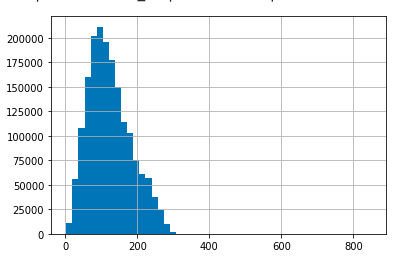
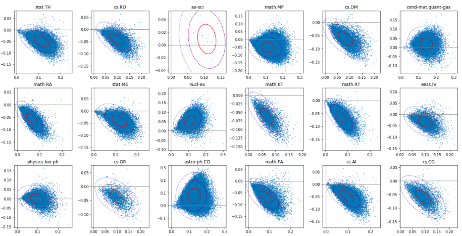
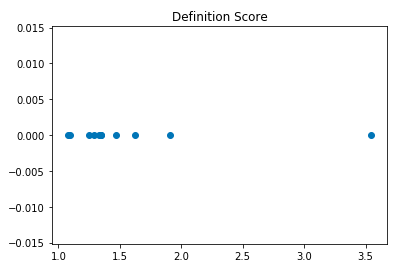
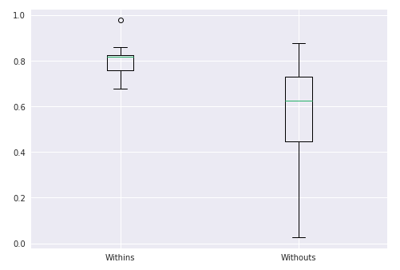

# ArXiv Recommendation System
*The ArXiv database contains millions of papers which are free to access. The sheer scope of the database means that most knowledge is likely underutilized: unless a paper/topic is specifically searched for it is unlikely to be found. This means that, while scholars and researchers are able to pull specific papers with ease, it is much more difficult to adequately explore this vast space of knowledge. By fitting a recommender system to the ArXiv database, we give scholars the tools to explore and discover new knowledge.*

*Because there is as of yet no data on different readers' ratings of articles, this recommendation system will be based solely on the content of the article abstracts*

## 1. Data
The data was obtained from the following sources:
> * [ArXiv Bulk Metadata](https://www.kaggle.com/Cornell-University/arxiv)
> * [ArXiv Category Taxonomy](https://arxiv.org/category_taxonomy)

The data used to built and test iterations of the recommender was sourced on August 27th of 2020. The Kaggle dataset is updated each week to include new articles. At the time of this project, metadata included the following:
> * ID: ArXiv ID which can be used to access the paper
> * Submitter: Name of the individual or organization which submitted the paper
> * Authors: Names of authors as they appear on the paper in a single string
> * Title: Title of the paper
> * Comments: Page numbers, number of figures, intent to publish, etc.
> * Journal-Ref: Imformation about the journal and issue the article was published in
> * DOI: [Digital Object Identifier](https://en.wikipedia.org/wiki/Digital_object_identifier)
> * Abstract: Abstract of the paper
> * Categories: Category tags created by ArXiv
> * Versions: version History

## 2. Data Cleaning
Due to the simple nature of the dataset, data cleaning was not extremely cumbersome. After removing a few duplicate entries into the database, we still had over 1.7 million datapoints to work with. Becuase the recommender would be based on the raw text of the articles abstracts, there was not much cleaning to be done here. The author and category features of the dataset were originally presented as single strings which had to be parsed into lists in order to take them into account as features. A second dataset was created using the author feature. This dataset listed each author represented in ArXiv along with the papers each was credited on.

## 3. EDA
Exploratory Data Analysis for this data set served two main purposes:
1. To confirm or refute assumptions made about the data
2. To perform feature engineering and convert existing features to be readable by the model

The graph above displays the distribution of abstract lengths in words. Most abstracts are around the 100 word mark which should give our machine learning model plenty to work with in determining article similarity. The distribution is also skewed heavily to the right menaing that the median and mean lie above the mode so we do not have to worry about not having enough content for the algorithm to use.

The above graph is the result of one example of the EDA performed. Because there are no users to evaluate our recommendatios, we must find additional features aside from the raw text to help support our recommender. To that end, we hope to determine whether the categories given by archive encode meaningful differences in vocabulary and semantics. If so, restricting recommendations to the same category can narrow the possibilities considerably without excluding possible matches. The above figure represents a two-dimensional decomposition of the Tfidf vectorized dataset. Each ellipse represents a standard deviation of the catagory's distribution. 

To test the claim that categories encode meaningful information about the content of articles we  break the categories into groups by the parent category (structure derived from ArXiv category taxonomy found above). We will then calculate the 95% confidence ellipse for each category and determine the overlap between each set of ellipses. If our hypothesis is correct then categories of the same parent category will have more overlap on average than categories of different parent categories. Parent categories are as follows:

1. Computer Science
2. Economics
3. Electrical Engineering Systems
4. Mathematics
5. Astro-Physics
6. Condensed Matter Physics
7. General Physics
8. Other Physics
9. Quantitative Biology
10. Quantitative Finance
11. Statistics

Note: The 'Other Physics' parent category is not an official parent category in the ArXiv taxonomy. Rather, it is an amalgam of physics parent categories which each only contained one sub-category and thus could not be considered true parent categories.

The 'Well Defined' metric (plotted in the dot plot above) divides self similarity by the average of cross category similarity for each parent category. Therefore, parent categories which are highly self similar and highly dissimilar to other categories score higher in this metric. From the metric we see that all of the categories score above 1, meaning that they are all more self similar than similar to other categories on average. 'Economics' and 'Other Physics' are the two least well definied categories. Possible explanations include the low number of 'Economics' subcategories, meaning higher variance in scores, and the fact that the 'Other Physics' category is an amalgam of single category physics parent categories and so cover a wide variety of topics between them, many of which my be shared by 'General Physics'. Aside from these two underperformers, the rest of the parentcategories have a definition score of 1.24 or higher.

The boxplot shows the distribution of overlaps between subcategories of the same parent category ('Withins') and subcategories of differing parent categories ('Withouts'). We can see from the plot that similarity within the same parent category is not only much higher on average than similarity without, but that the distribution of similarities within the same parent categories is much tighter. From this we may reasonably conclude that our previous hypotheses were correct and that the category does in fact encode meaningful information about the terminology of an article. Therefore, when crafting our recommender, we may consider recommending only articles which share a category with the original article of interest.

## 4. Modeling and Performance
Before iterating recommender versions, we first defined a scoring system to compare each iteration with. The score was based upon the abstracts of the top ten articles returned by each recommender. Each abstract was rated on a simple similarity scale to the originial article of interest with the recommender receiving the average score of all ten articles.

The abstract and metadata of the original article is as follows:
> * Authors: Ileana Streinu and Louis Theran
> * Categories: math.CO (combinatorics) & cs.CG (computational geometry)
> * Abstract: We describe a new algorithm, the $(k, l)$-pebble game with colors, and use it obtain a characterization of the family of $(k, l)$-sparse graphs and algorithmic solutions to a family of problems concerning tree decompositions of graphs. Special instances of sparse graphs appear in rigidity theory and have received increased attention in recent years. In particular, our colored pebbles generalize and strengthen the previous results of Lee and Streinu and give a new proof of the Tutte-Nash-Williams characterization of arboricity. We also present a new decomposition that certifies sparsity based on the $(k, l)$-pebble game with colors. Our work also exposes connections between pebble game algorithms and previous sparse graph algorithms by Gabow, Gabow and Westermann and Hendrickson.

The first recommender was created by Tfidf vectorizing the abstracts of all articles in each parent category to create a dictionary of vectorizations by category. This allowed vectorizations to be computer quickly since it cut down on the corpus size, while also narrowing down the number of articles to search through to the ones with the greatest chance of relevance since they are all from the same category. Articles were scored by the algorithm using cosine similarity and ranked with the top 10 articles being returned as recomendations. The evaluation scores for the first recommender are as follows:

The second recommender was created using a similar approach to the first but each category was vectorized using Doc2Vec. The algorithm then computed scores using dot product rather than cosine similarity and articles were ranked with the top 10 being returned as recommendations. The evaluation scores for the second recommender are as follows:

The third recommender was essentially a carbon copy of the second, the only difference being that scores were computed using cosine similarity rather than dot product. The evaluation scores for the third recommender are as follows:

The fourth and final recommender was created using a hybrid approach. The Tfidf vectorizer was used to determine the top 100 most similar articles from each category. The top 100 overall were then revectorized using Doc2Vec and ranked according to cosine similarity with the top 10 being returned as recommendations. The evaluation scores for the fourth recommender are as follows:

Of the iterations above, the original Tfidf Vectorizer produced the best results by our metric. This vectorizer returned the most relevant articles with only a few articles recommended due to notation. The Doc2Vec vectorizer returned articles of the same general category or irrelevant articles, but no articles of specific relevance to the original article. When using cosine similarity rather than dot product, the Doc2Vec vectorizer seems to return articles with the shortest possible abstracts and almost none have any relevance to the original article. The hybrid approach of ranking by the Tfidf vectorizer and then using Doc2Vec on the top 100 to choose the top ten recommendations yielded better results than the other two Doc2Vec approaches, but still failed to return articles as relevant as the Tfidf vectorizer.

## 5. Further Exploration
Because the recommender system was only content based and could not use any user reviews, we could not hope for performance on par with the state of the art recommender systems of today. Creating a platform for this simple recommender would allow for the accumulation of user reviews which could be merged into the model over time. Further, another useful piece of metadata would be the articles cited by each article. A network created in this way would be highly valuable for finding the most relevant articles. Lastly, hierarchical clustering of the vectorized dataset would provide an interesting way to visualize the data and may even lead to the creation of more meaningful categories for organizing the articles.

## 6. Use
All of the notebooks are available to for download. While citation is not necessary, I would be interested to hear about any extensions or uses of this project (project links may be sent to gabriel.yawin@gmail.com).

~
